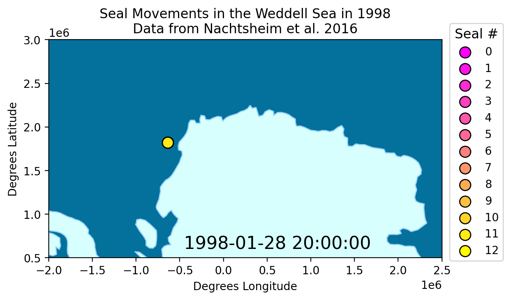

# seal-tracking-gif

This repository contains a notebook that is used to generate the individual frames needed to create the below gif:

<div class="nav3" style="height:705px;">
    </a>
</div>

To re-create this gif, you'll first need to download the data from the supplement to [Nachtsheim et al 2016](https://doi.org/10.1007/s00300-016-2020-0). Fortunately, the authors uploaded the supplemental data to PANGAEA: [data link](https://doi.org/10.1594/PANGAEA.854842). Replace the contents of the "datasets" subdirectory with the downloaded "datasets" directory.

Next you can run the notebook, and populate a subdirectory "frames" with the individual frames which form the animation.

To create the animation itself, run the below lines in a terminal. 

```
convert -delay 30 -loop 0 -dispose previous frames/*.png seals.gif

gifsicle -O3 seals.gif > seals_small.gif
```

Good luck!
